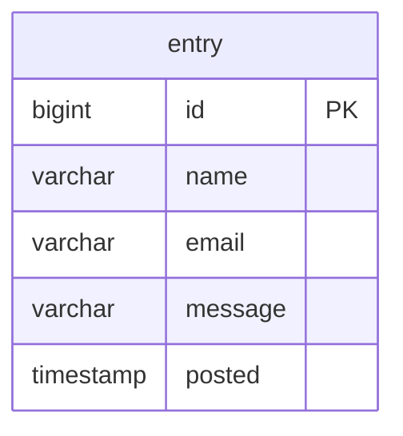
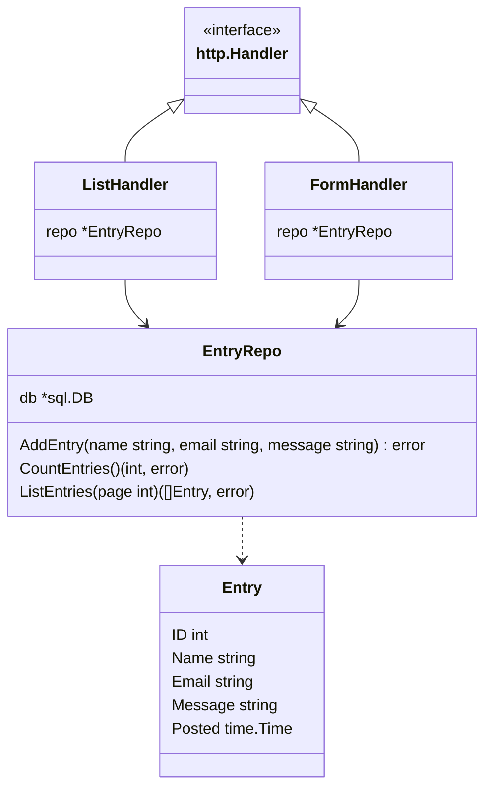

# Ein Gästebuch in Go mit PostgreSQL

Ein Klassiker im Internet aus der Zeit vor dem Siegeszug der sozialen Medien ist das Gästebuch. Was Anfang der 2000er
noch bei vielen Homepages anzutreffen war, ist heute auch wegen Spam und anderer unerwünschter Inhalte kaum noch zu
finden. Ein Gästebuch zu erstellen ist allerdings eine gute Übung für den Einstieg in die Entwicklung von
Webanwendungen.

Wir werden in diesem Tutorial das Gästebuch mit der Programmiersprache [Go](https://go.dev/) in der Version 1.24 und
mit einer [PostgreSQL](https://www.postgresql.org/) Datenbank entwickeln.

## Datenmodell

Jeder Gästebucheintrag wird als Datensatz bestehend aus den Werten `name`, `email`, `message` sowie einem automatischen
Timestamp für den Zeitpunkt der Erstellung in einer einzelnen Tabelle abgelegt. Die Tabelle wird außerdem eine
automatisch vergebene numerische id als Primärschlüssel haben.



Eine Webanwendung sollte nicht mit dem Superuser auf die Datenbank zugreifen, also erstellen wir als Erstes einen neuen
Datenbankbenutzer und ein dazu passendes Schema. Wir verwenden den Befehl
`psql --host=localhost --port=5432 --username=postgres` und melden uns mit dem Superuser `postgres` an der lokal
installierten Datenbank an und führen die folgenden Statements aus.

```postgresql
CREATE USER guestbook WITH PASSWORD 'trustno1';
GRANT CONNECT ON DATABASE postgres TO guestbook;
CREATE SCHEMA AUTHORIZATION guestbook;
```

Mit dem neu angelegten Datenbankbenutzer können wir jetzt in das ebenfalls neu angelegte Schema die Tabelle erstellen.
Wir melden uns mit dem Befehl `psql --host=localhost --port=5432 --username=guestbook` als neuer Datenbankbenutzer
`guestbook` an und führen das folgende Statement aus um die Tabelle `entry` anzulegen.

```postgresql
CREATE TABLE "entry" (
    "id" BIGINT GENERATED ALWAYS AS IDENTITY (START WITH 1 INCREMENT BY 1) PRIMARY KEY,
    "name" VARCHAR(255) NOT NULL,
    "email" VARCHAR(255) NOT NULL,
    "message" VARCHAR(1023) NOT NULL,
    "posted" TIMESTAMP(3) DEFAULT CURRENT_TIMESTAMP NOT NULL
);
```

## Go-Projekt initialisieren

Das Gästebuch werden wir mit dem `net/http`-Package aus der Go-Standard-Library umsetzen, was bedeutet die Go-Anwendung
wird einen eigenen HTTP-Server starten und man kann dann mit dem Browser auf dem Port 8080 die Webanwendung öffnen.

Zuerst müssen wir das Modul für die Gästebuchanwendung mit dem Befehl `go mod init guestbook` initialisieren.
Wir legen danach eine neue `main.go` Quellcode-Datei mit folgendem Inhalt and um den HTTP-Server zu starten.

```go
package main

import (
  "flag"
  "fmt"
  "log"
  "net/http"
)

func main() {
  var port int
  flag.IntVar(&port, "port", 8080, "HTTP server port")
  flag.Parse()

  log.Printf("Starting web server on http://localhost:%d", port)
  if err := http.ListenAndServe(fmt.Sprintf(":%d", port), nil); err != nil {
    log.Fatal(err)
  }
}
```

## PostgreSQL-Datenbankverbindung

Um eine Verbindung zur Datenbank herstellen zu können brauchen wir ein weiteres Modul, das wir zuerst installieren müssen.

```
go get github.com/lib/pq
```

Wir initialisieren in der `main`-Funktion ein `DB`-Objekt.

```go
package main

import (
  "database/sql"
  "flag"
  "fmt"
  _ "github.com/lib/pq"
  "log"
  "net/http"
)

func main() {
  var (
    port        int
    databaseURL string
  )
  flag.IntVar(&port, "port", 8080, "HTTP server port")
  flag.StringVar(&databaseURL, "database-url", "postgres://postgres:@localhost:5432/postgres?sslmode=disable", "Database URL")
  flag.Parse()

  log.Print("Initializing database connection")
  if db, err := sql.Open("postgres", databaseURL); err == nil {
    defer db.Close()
  } else {
    log.Fatal(err)
  }

  log.Printf("Starting web server on http://localhost:%d", port)
  if err := http.ListenAndServe(fmt.Sprintf(":%d", port), nil); err != nil {
    log.Fatal(err)
  }
}
```

## Gästebuch-Logik

Die eigentliche Logik des Gästebuchs implementieren wir in den beiden Structs `ListHandler` und `FormHandler`.
Außerdem werden wir eine `EntryRepo`-Struct erstellen in dem die Zugriffe auf die Datenbank
gekapselt werden.



### Datenmodell

Zuerst legen wir in der Quellcode-Datei `entry.go` ein `Entry`-Struct an.

```go
package main

import (
  "time"
)

type Entry struct {
  ID      int
  Name    string
  Email   string
  Message string
  Posted  time.Time
}
```

### Datenbankzugriff

Die Logik für den Datenbankzugriff schreiben wir in die drei Methoden `AddEntry`, `CountEntries` und `ListEntries` in
der Quellcode-Datei `entryrepo.go`.

```go
package main

import (
  "database/sql"
)

const MaxEntriesPerPage = 10

type EntryRepo struct {
  db *sql.DB
}

func (repo *EntryRepo) AddEntry(name, email, message string) error {
  _, err := repo.db.Exec(`INSERT INTO "entry" ("name", "email", "message") VALUES ($1, $2, $3)`, name, email, message)
  return err
}

func (repo *EntryRepo) CountEntries() (int, error) {
  row := repo.db.QueryRow(`SELECT COUNT(*) FROM "entry"`)
  if row.Err() != nil {
    return 0, row.Err()
  } else {
    var count int
    if err := row.Scan(&count); err != nil {
      return 0, err
    }
    return count, nil
  }
}

func (repo *EntryRepo) ListEntries(page int) ([]Entry, error) {
  var entries []Entry
  if rows, err := repo.db.Query(` SELECT "id", "name", "email", "message", "posted"
                                          FROM "entry"
                                          ORDER BY posted DESC
                                          LIMIT $1 OFFSET $2`,
    MaxEntriesPerPage,
    (page-1)*MaxEntriesPerPage); err != nil {
    return nil, err
  } else {
    defer rows.Close()
    for rows.Next() {
      var entry Entry
      if err := rows.Scan(&entry.ID, &entry.Name, &entry.Email, &entry.Message, &entry.Posted); err != nil {
        return nil, err
      }
      entries = append(entries, entry)
    }
  }
  return entries, nil
}
```

### Darstellung des Gästebuchs

Zur Darstellung der Gästebuchseiten und des Formulars nutzen wir ein Template. Den Quellcode des Templates speichern
wir in der Datei `template.gohtml`. Das Template enthält auch das HTML-Form-Element zum Anlegen neuer Gästebucheinträge.

```html
<!DOCTYPE html>
<html>
<head>
  <meta charset="UTF-8">
  <title>Guestbook</title>
  <link href="static/style.css" rel="stylesheet">
</head>
<body>
<div class="container">
  <h1>Guestbook</h1>
  <form method="post">
    <label for="nm">Name:</label>
    <input type="text" name="name" id="nm" required>
    <label for="eml">eMail:</label>
    <input type="email" name="email" id="eml" required>
    <label for="msg">Message:</label>
    <textarea name="message" id="msg" rows="5" required></textarea>
    <button type="submit">Post</button>
  </form>
  {{ range .entries }}
  <div class="entry">
    <div>
      <a href="mailto:{{ .Email }}">{{ .Name }}</a><br>
      <small>{{ .Posted }}</small>
    </div>
    <div class="message">{{ .Message }}</div>
  </div>
  {{ end }}
  <div class="pages">
    Page
    {{ range $n := .pageNumbers }}
      {{ if eq $n $.page }}
        {{ $n }}
      {{ else }}
      <a href="?page={{ $n }}">{{ $n }}</a>
      {{ end }}
    {{ else }}
    1
    {{ end }}
  </div>
</div>
</body>
</html>
```

Die CSS-Regeln legen wir in der separaten Datei `static/style.css` ab.

```css
body {
    background-color: whitesmoke;
    color: black;
    font-family: 'Comic Sans MS', cursive;
    padding: 0;
    margin: 2em;
}

form {
    background-color: gainsboro;
    padding: 2em;
    display: flex;
    flex-direction: column;
    gap: 0.5em;
    margin: 2em 0;
}

input, textarea, select {
    background-color: white;
    color: black;
    border: none;
    font-family: 'Comic Sans MS', cursive;
    font-size: 1em;
}

button {
    font-family: 'Comic Sans MS', cursive;
    padding: 1em;
    text-align: center;
    background-color: lightsteelblue;
    border-top: none;
    border-left: none;
    border-bottom: 2px solid steelblue;
    border-right: 2px solid steelblue;
    border-radius: 0.5em;
    font-size: 1em;
    cursor: pointer;
}

button:active {
    border-top: 2px solid steelblue;
    border-left: 2px solid steelblue;
    border-bottom: none;
    border-right: none;
}

textarea {
    resize: none;
}

a {
    color: steelblue;
}

a:hover {
    color: firebrick;
}

.container {
    margin: 0 auto;
    width: 740px;
}

.entry {
    background-color: wheat;
    padding: 2em;
    margin: 2em 0;
}

.message {
    margin-top: 1em;
    white-space: pre-wrap;
}

.pages {
    background-color: gainsboro;
    padding: 2em;
    text-align: center;
}
```

### Formularverarbeitung

Den Quellcode für den `ListHandler` schreiben wir in die Datei `listhandler.go`. Wir laden das Template aus
`template.gohtml` und verarbeiten den Parameter `page`. Anschließend laden wir die Gästebucheinträge für die angegebene
Seite aus der Datenbank und führen das Template aus um den HTML-Code für den Browser zu erzeugen.

```go
package main

import (
  _ "embed"
  "fmt"
  "log"
  "math"
  "net/http"
  "strconv"
  "strings"
  "text/template"
)

//go:embed template.gohtml
var templateText string

type ListHandler struct {
  repo *EntryRepo
}

func (h *ListHandler) ServeHTTP(w http.ResponseWriter, r *http.Request) {
  var (
    parsedTemplate     *template.Template
    page               = 1
    currentPageEntries []Entry
    totalEntries       int
  )
  if t, err := template.New("template.gohtml").Parse(templateText); err != nil {
    log.Print(err)
    http.Error(w, "Error parsing template: "+err.Error(), http.StatusInternalServerError)
    return
  } else {
    parsedTemplate = t
  }

  var pageParam = strings.TrimSpace(r.FormValue("page"))
  if pageParam != "" {
    if i, err := strconv.Atoi(pageParam); err != nil {
      log.Print(err)
      http.Error(w, "Error parsing page parameter: "+err.Error(), http.StatusBadRequest)
      return
    } else {
      page = i
    }
  }

  if page < 1 {
    http.Error(w, fmt.Sprintf("Invalid page number %d", page), http.StatusBadRequest)
    return
  }

  if entries, err := h.repo.ListEntries(page); err != nil {
    log.Print(err)
    http.Error(w, "Error loading entries: "+err.Error(), http.StatusInternalServerError)
    return
  } else {
    currentPageEntries = entries
  }

  if count, err := h.repo.CountEntries(); err != nil {
    log.Print(err)
    http.Error(w, "Error counting entries: "+err.Error(), http.StatusInternalServerError)
    return
  } else {
    totalEntries = count
  }
  var pageCount = int(math.Ceil(float64(totalEntries / MaxEntriesPerPage)))
  var pageNumbers = make([]int, 0, pageCount)
  for i := 1; i <= pageCount; i++ {
    pageNumbers = append(pageNumbers, i)
  }

  var templateData = map[string]any{
    "entries":      currentPageEntries,
    "totalEntries": totalEntries,
    "page":         page,
    "pageNumbers":  pageNumbers,
  }

  if err := parsedTemplate.ExecuteTemplate(w, "template.gohtml", templateData); err != nil {
    log.Print(err)
    http.Error(w, "Error executing template: "+err.Error(), http.StatusInternalServerError)
    return
  }
}
```

Den Quellcode für den `FormHandler` schreiben wir in die Datei `formhandler.go`. Der `FormHandler` verarbeitet
abgeschickte Formulare. Zuerst wird validiert, ob die drei Felder `name`, `email` und `message` gesetzt sind. Wir
entfernen vor der Validierung mit `strings.TrimSpace` unnütze Whitespace-Zeichen vor und nach den Formularfelder-Werten.

Wenn alle Felder vorhanden sind, wird mit der Methode `AddEntry` von `EntryRepo` ein neuer Gästebucheintrag in der
Datenbank gespeichert und anschließend auf die Startseite weitergeleitet. Sollte ein Feld fehlen oder ein Fehler beim
Speichern auftreten, wird eine Fehlermeldung ausgegeben.

```go
package main

import (
  "net/http"
  "strings"
)

type FormHandler struct {
  repo *EntryRepo
}

func (h *FormHandler) ServeHTTP(w http.ResponseWriter, r *http.Request) {
  var (
    name    = strings.TrimSpace(r.PostFormValue("name"))
    email   = strings.TrimSpace(r.PostFormValue("email"))
    message = strings.TrimSpace(r.PostFormValue("message"))
  )

  if name == "" || email == "" || message == "" {
    http.Error(w, "name, email and message are required", http.StatusBadRequest)
    return
  }

  if err := h.repo.AddEntry(name, email, message); err != nil {
    http.Error(w, "Error creating entry: "+err.Error(), http.StatusInternalServerError)
  } else {
    http.Redirect(w, r, "/", http.StatusFound)
  }
}
```

## Routing

Die beiden Handler müssen wir mit einer passenden Route in der `main`-Funktion registrieren. Die Route `POST /{$}`
bedeutet beispielsweise das alle Requests mit dem HTTP-Verb **POST** auf den Pfad `/` von unserem `FormHandler`
verarbeitet werden sollen. Wir registrieren auch mit `http.FileServer` eine Route für alle Requests die an Pfade gehen,
welche mit `/static/` beginnen. Damit unsere CSS-Datei an den Browser ausgeliefert wird.

```go
package main

import (
  "database/sql"
  "embed"
  "flag"
  "fmt"
  _ "github.com/lib/pq"
  "log"
  "net/http"
)

//go:embed static/*
var staticFiles embed.FS

func main() {
  var (
    port        int
    databaseURL string
  )
  flag.IntVar(&port, "port", 8080, "HTTP server port")
  flag.StringVar(&databaseURL, "database-url", "postgres://postgres:@localhost:5432/postgres?sslmode=disable", "Database URL")
  flag.Parse()

  var repo *EntryRepo

  log.Print("Initializing database connection")
  if db, err := sql.Open("postgres", databaseURL); err == nil {
    repo = &EntryRepo{db}
    defer db.Close()
  } else {
    log.Fatal(err)
  }

  var (
    listHandler = &ListHandler{repo}
    formHandler = &FormHandler{repo}
    fileHandler = http.FileServer(http.FS(staticFiles))
  )

  http.Handle("GET /{$}", listHandler)
  http.Handle("POST /{$}", formHandler)
  http.Handle("GET /static/", fileHandler)

  log.Printf("Starting web server on http://localhost:%d", port)
  if err := http.ListenAndServe(fmt.Sprintf(":%d", port), nil); err != nil {
    log.Fatal(err)
  }
}
```

## Gästebuch-Anwendung starten

Die Anwendung kann mit den folgenden Befehlen kompiliert und ausgeführt werden. Mit dem Parameter `--database-url`
müssen die Datenbankverbindungsdaten angegeben werden.

```bash
go build -o guestbook.exe
guestbook.exe --database-url "postgres://postgres:@localhost:5432/postgres?sslmode=disable"
```
